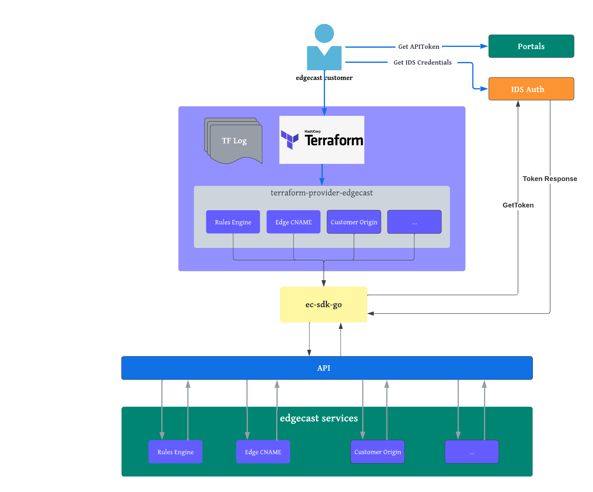

# Edgecast Terraform Provider Architecture
[terraform-provider-edgecast](https://github.com/EdgeCast/terraform-provider-edgecast)
is the official Terraform provider for the Edgecast Platform.

## Structure 
### Root files
- `Makefile` contains helper functions to build, install, release, and test the
provider.
- `install_win.bat` provides install functionality for Windows environments.
- `main.go` is the entry point. It creates the executable Go binary that 
Terraform consumes. It uses the Teraform Plugin SDK to return an instance of the
provider.

### Root folders
- `docs` contains markdown auto-generated by `tfplugindocs`. This documentation 
is consumed by the Terraform Registry and can be viewed
[here](https://registry.terraform.io/providers/Edgio/edgecast/latest/docs).
- `edgecast` is the folder that contains all of the provider and resource Go code.
- `examples` contains example Terraform configuration files to serve as a
starting point or as a reference to consumers of this provider. The examples are
organized by resource.
- `templates` contains the `tfplugindocs` templates from which the documents
within `docs` are generated. Templates are optional - `tfplugindocs` will create
satisfactory docs in most cases without a template. Use a template when you need
to fine tune the documentation. Templates are organized by resource similar to
the `examples` folder.
- `tools` contains references to any support tools for the repository
e.g. `tfplugindocs` for Terraform document generation.

### edgecast
- `edgecast/provider.go` defines the Edgecast provider. Its configuration schema is 
defined as well as all of the resources it manages. All bootstrapping for the 
provider occurs here. Most importantly, the raw provider configuration is mapped
to a `ClientConfig` object which is passed to each individual resource's CRUD
functions as an `interface{}` parameter.
- `edgecast/api` is deprecated. Do not add new code here. All new resources should use
the Edgecast Go SDK. The sole exception is the `ClientConfig` type, which will
eventually be pulled out of `edgecast/api`.
- `edgecast/helper` contains utility code for json, Terraform, etc.
- `edgecast/resources` contains the available resources. They are organized by 
feature. For example, all WAF resources lie within `edgecast/resources/waf`. 
Ultimately, these are referenced in `edgecast/provider.go`. Each Resource's CRUD 
function has the provider configuration injected into it via the `m interface{}` 
parameter.

### Provider Diagram

